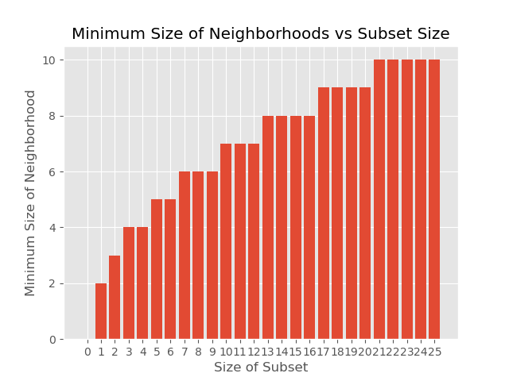

# MinimalOutNeighbors
_Definition_: For a directed graph $D$, and a subset $S$ of its vertices, define its _out-neighborhood_ $N_+(S)$ to be all vertices of $S$ together with any vertex $w \in V(D)$ such that $\overrightarrow{vw}$ is an edge of $D$ for some $v \in S$.

_Definition_: The $F$-lattice is the directed graph on the plane integer lattice with an edge from $x = (x_1, x_2)$ to $x \pm e_1$ if $x_1 + x_2$ is even, and from $x = (x_1,x_2)$ to $x \pm e_2$ if $x_1 + x_2$ is odd.

### Questions
_Definition_: The _Hamming ball of radius r, denoted $B_r[v]$, is the set of all vertices $v \in V(D)$ reachable by a (directed) path of length $r$ from the origin.

1. Given $n \in \mathbb{N}$, what is the smallest possible out-neighborhood of a set $S$ of $n$ vertices?
2. Are the Hamming balls of radius $r$ always minimizers of their respective sizes?

### Preliminary Results
_Sean's Grate conjecture_: Given a subset of $n$ vertices of the $F$-lattice, the smallest possible out-neighborhood is given by [A027434](https://oeis.org/A027434).

_Nicholas' big conjecture_: In particular, some, but not all, minimizers can be described via [A027709](https://oeis.org/A027709).

_Joe's bold conjecture_: The answer to Question 2 is yes.

